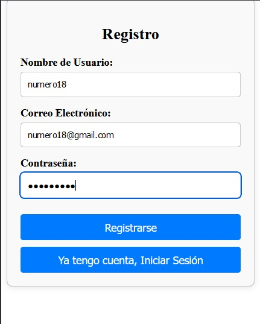
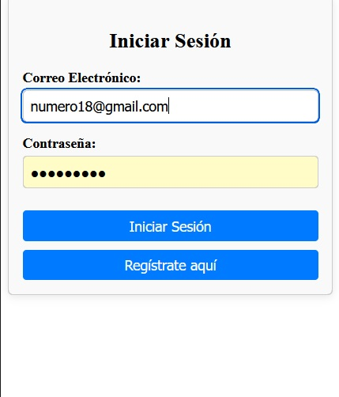
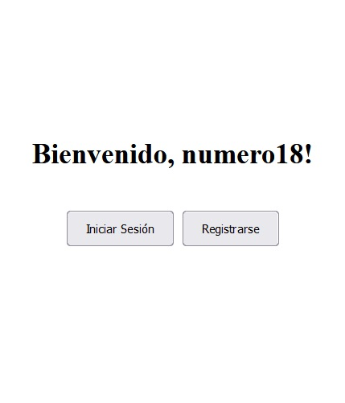
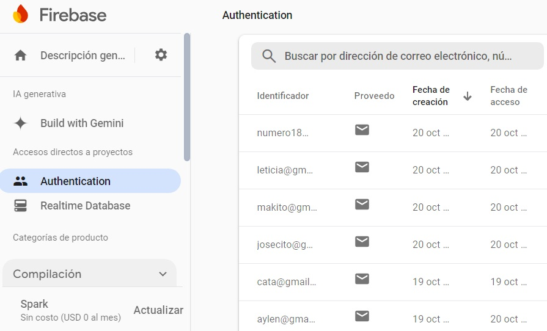

# Login Application
 
Este es un proyecto de aplicación de autenticación desarrollado con **Angular version 18.2.9.**, que permite a los usuarios registrarse, iniciar sesión y cerrar sesión utilizando **Firebase Authentication**. La aplicación incluye formularios de registro y login, y muestra el nombre del usuario en la página de inicio después de iniciar sesión correctamente.

## Características principales

- **Registro de usuarios**: Los usuarios pueden registrarse proporcionando un nombre de usuario, correo electrónico y contraseña.
- **Inicio de sesión**: Los usuarios registrados pueden iniciar sesión y acceder a la página de inicio, donde se muestra un mensaje personalizado con su nombre.
- **Firebase Authentication**: El proyecto utiliza Firebase para gestionar la autenticación de usuarios.
- **Redirección automática**: Después del registro o inicio de sesión, los usuarios son redirigidos a las páginas correspondientes.
- **Logout**: Los usuarios pueden cerrar sesión y serán redirigidos al formulario de inicio de sesión.


## Tecnologías utilizadas

- **Angular CLI**: Framework principal para desarrollar la aplicación.
- **Firebase**: Plataforma utilizada para la autenticación y almacenamiento de usuarios.
- **Bootstrap**: Para el diseño responsivo y estilizado de la interfaz.
  








## Instalación y configuración

### Requisitos previos

1. Asegúrate de tener **Node.js** instalado. Puedes descargarlo desde [nodejs.org](https://nodejs.org/).
2. Instala el **Angular CLI** globalmente ejecutando el siguiente comando:

   ```bash
   npm install -g @angular/cli
